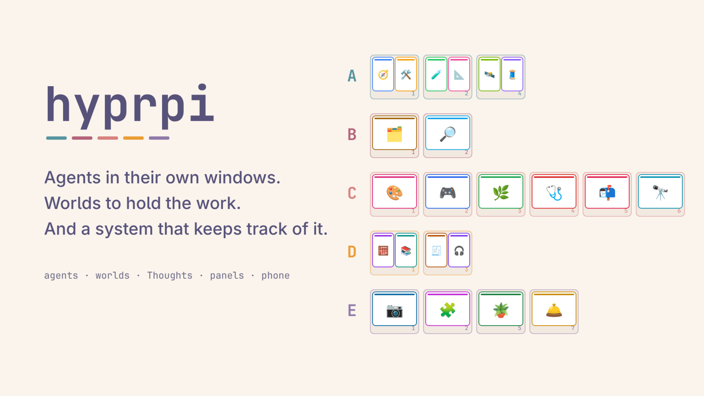
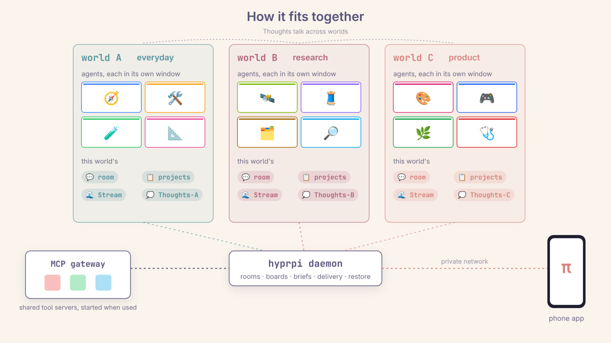
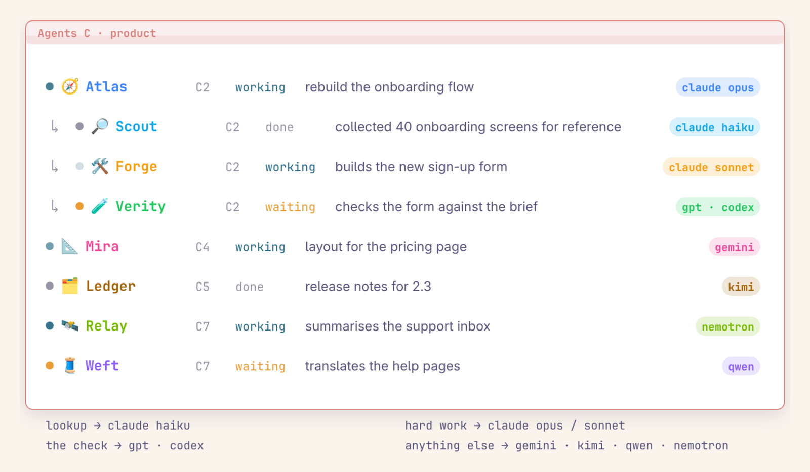
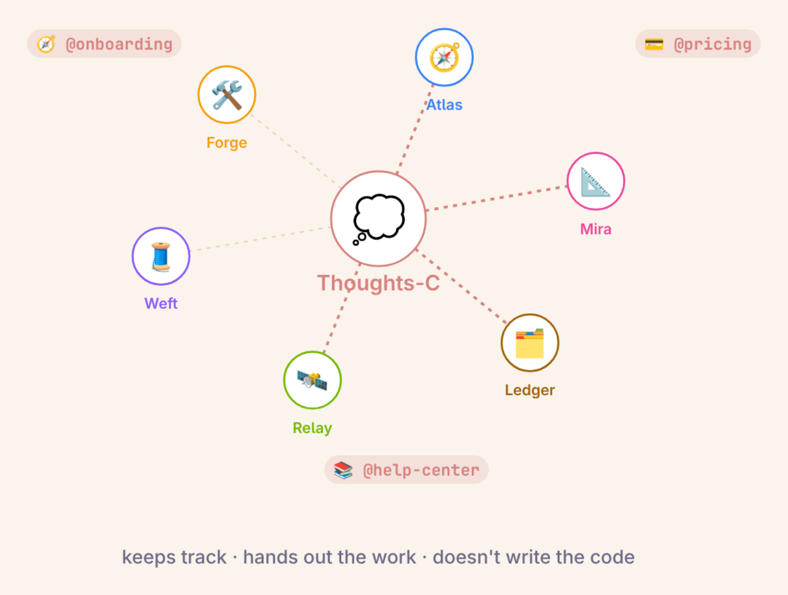
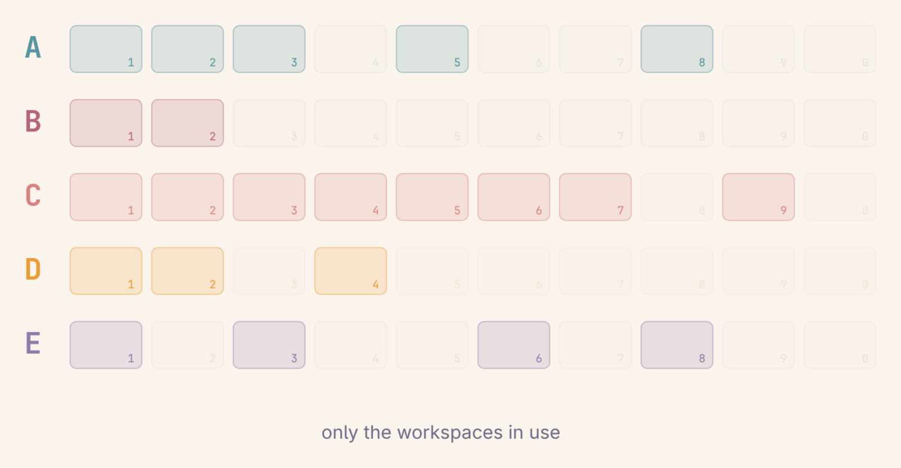
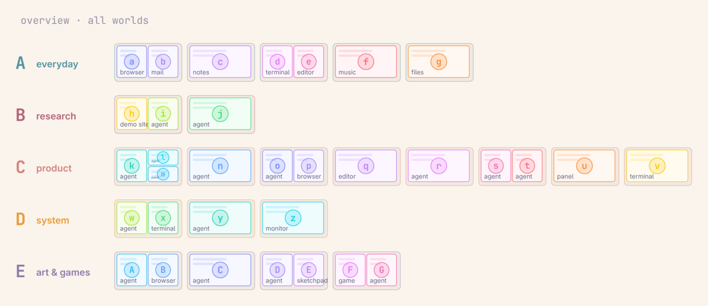
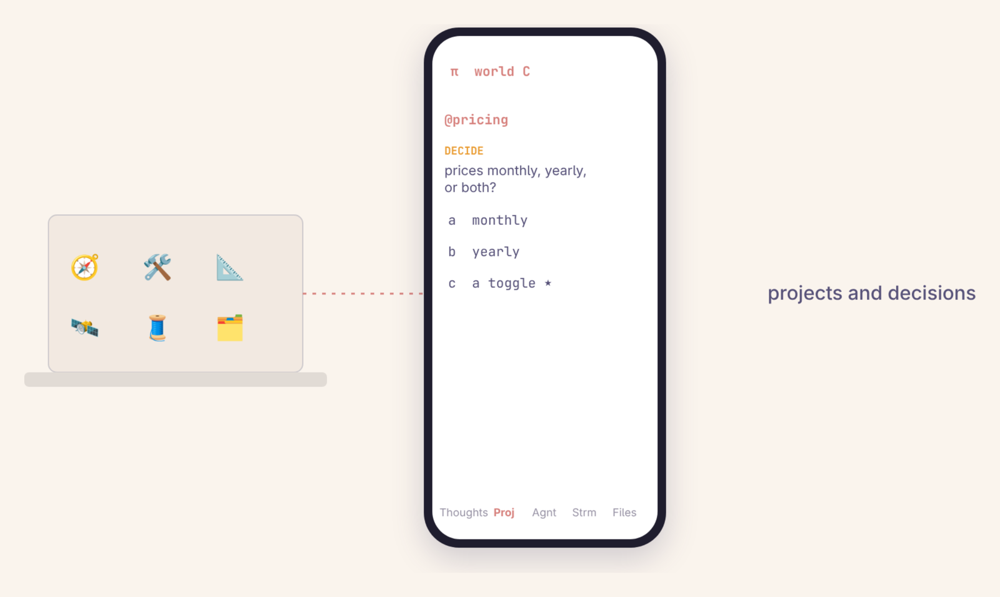
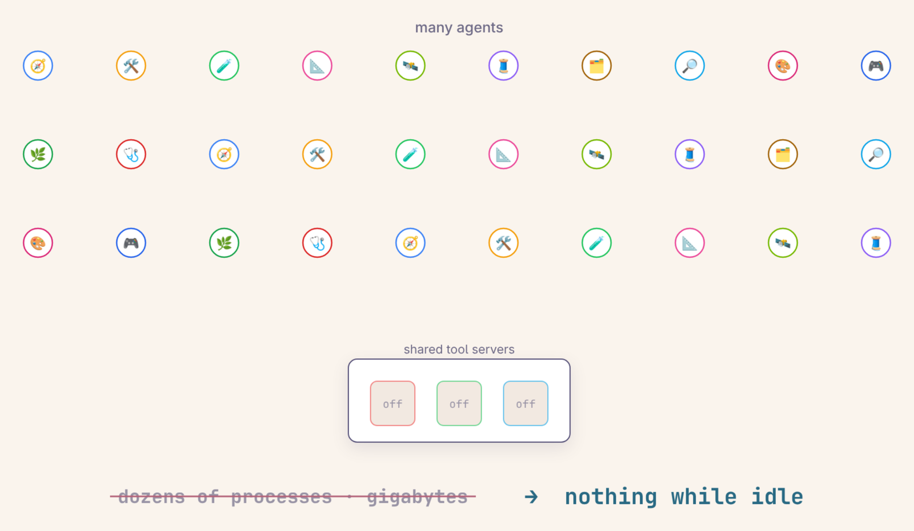

# hyprpi

**AI coding agents that live on your desktop, each in its own terminal window, organised into worlds, with panels and a per-world assistant that keep track of all of it.** Built on [Hyprland](https://hypr.land) and the [pi](https://github.com/earendil-works/pi) coding agent; at home on [Omarchy](https://omarchy.org).

- **Agents in their own windows.** Every agent is an ordinary terminal window running pi. You move it, tile it, put it on any workspace, and it keeps its name, colour and conversation.
- **Worlds to hold the work.** Workspaces are grouped into worlds (A = workspaces 1–10, B = 11–20, …). Each world has its own agents, a shared room, a project board and its own Thoughts, an assistant that keeps track of the world for you.
- **A system that keeps track of it.** A small background daemon routes messages, keeps the boards, hands out work as briefs, restores everything after a crash and keeps idle agents tidy, so many agents can work at once without you hunting for them.

## How it fits together

This repo holds hyprpi and the desktop pieces it is built around. Each can be installed on its own:

| Part | What it is |
|---|---|
| hyprpi | agents in their own windows, rooms, panels, Thoughts |
| hyprwrlds | worlds: blocks of ten workspaces, keys, bar widget |
| hyprwrlds-vimarchy | an overview to see and jump around worlds |
| remote-control | the π phone app for agents, panels and files |
| mcp-gateway | shared, lazily started MCP servers for all agents |

## Install

**Requirements:** Linux with Hyprland 0.56 or newer and its Lua config (`hyprland.lua`), Node.js 22+, a terminal (kitty recommended), and pi 1.0.x logged in to a model provider. Omarchy is needed only for the extras that live in its bar and menus (the finder, the bar widgets). Details: [docs/requirements.md](docs/requirements.md).

On Arch / Omarchy the tools are one line:

`sudo pacman -S --needed nodejs npm kitty jq fd wl-clipboard libnotify libvips`

Then clone and install, wherever you like:

`git clone https://github.com/angusforbes/hyprpi && cd hyprpi`

`./install.sh`

This installs the recommended pieces: `hypr` (hyprpi's keys and window rules, linked into `~/.config/hypr` and required from `hyprland.lua`), `path` (the `hyprpi` command in `~/.local/bin`), `bar` (the finder and the login mark; Omarchy only) and `kitty` (one include line for Ctrl+click links). If pi is missing it offers to install the tested version into `~/.local` (no sudo).

Optional pieces, in this order: `./install.sh hyprwrlds hyprwrlds-vimarchy gateway remote` (or `./install.sh all` for everything).

Then run `pi` once and `/login`, and press **SUPER+A** for your first agent.

### Uninstall

Every piece is opt-in and reversible. `hyprpi integration status` shows what is installed; `hyprpi integration uninstall NAME…` undoes exactly what its install did (links, the lines it added, the services it wrote), and `hyprpi integration uninstall all` removes everything. Backups of files it edited stay in `~/.local/state/hyprpi/backups/`. Nothing touches your shell's rc files. Your agents' conversations are pi's own sessions and are never deleted.

### Settings

hyprpi's behaviour is set in one file, `~/.config/hyprpi/hyprpi.jsonc`, written on first run with every default and a comment on each; changes apply within a minute, no restart. For example, `"user": { "name": "Sam" }` sets the name the panels and the phone show for your messages (default: your login name).

## hyprpi: agents in their own windows

**SUPER+A** opens a new agent: a terminal window running pi on the workspace you are on. It joins that world's room, gets a name and a colour, and from then on it is part of the world: the other agents can talk to it, Thoughts can hand it work, and it shows up in the panels.

The panels are small terminal apps (TUIs), one of each per world:

- **Agents** (SUPER+ALT+A): every agent in the world with its state (working ●, done ✓, needs you ×), what it is doing and its model. Enter jumps to an agent's window; closed and parked agents can be brought back. Agents that spawned helpers show them indented underneath.
- **Stream** (SUPER+ALT+R): one timeline of the world: what each agent did, posts, messages between agents, board changes. Filter it by agent, project or time (`/stream @Mira 3h`); Ctrl+F switches between full, compact, topics and "all activity".
- **Projects** (SUPER+ALT+P): the world's project board. Each project has a card with where it stands, next steps, decisions waiting on you and what's done. Agents keep their cards current; you answer decisions right there.
- **Thoughts** (SUPER+ALT+/): talk to the world's Thoughts (below), or search everything that happened in the world, by keyword or by asking a question.

**SUPER+S** summons agents, panels and app windows to the workspace you are on, **SUPER+D** sends one home, and **SUPER+ALT+S** pins a window so it stays. With Omarchy, **SUPER+SHIFT+SPACE** finds any agent or project by name.

Everything survives: close an agent's window and it can be resumed with its conversation; after a crash or reboot, hyprpi offers to restore every window and panel where it was.

### Thoughts: a colleague for each world

Each world has a Thoughts agent you talk to in the Thoughts panel (or from your phone). Think out loud with it, ask what is going on, or ask for something to be done. It knows the world's agents, projects and history; it answers questions by asking the agents that know, and it turns a request into a **brief** (a job with a goal, limits and "done when" checks) for the right agent, splitting bigger jobs between several agents and having a different one test the result. It tells you when something needs your decision, and it never writes the code itself.

Agents can also work together without you: they message each other, spawn short-lived helpers for parts of a job (shown under their parent in the agents panel), choose a cheaper or stronger model for each helper, and close them when done.

## hyprwrlds: projects live in worlds

hyprwrlds adds **worlds** to Hyprland: a world is a block of ten workspaces (A = 1–10, B = 11–20, … I = 81–90). SUPER+1…0 goes to a workspace of the current world, SUPER+CTRL+1…9 switches worlds, and SUPER+ALT+arrows walk the grid of workspaces and worlds. A bar widget (Omarchy) shows the worlds in their colours and the workspaces in use.

In hyprpi each world is one area of work: its own agents, room, board and Thoughts. Keep a world per project or per kind of work and switch between them without losing anything.

It works without hyprpi too. Keys and details: [hyprwrlds/README.md](hyprwrlds/README.md). Also published on its own as [angusforbes/hyprwrlds](https://github.com/angusforbes/hyprwrlds).

## hyprwrlds-vimarchy: a fast way to navigate

An overview of your worlds, inspired by [Vimarchy](https://github.com/clickety-clacks/vimarchy) and in its look: every workspace as a mini-screen with a preview of each window and a letter on it. Type the letter to jump to that window, or move windows between workspaces and worlds from the keyboard.

| Keys | Shows |
|---|---|
| ALT+SPACE | the current workspace |
| ALT+CTRL+SPACE | the current world, workspaces side by side |
| ALT+SHIFT+SPACE | all worlds, one row each |

It needs hyprwrlds and Quickshell (built into Omarchy's shell; there is also a standalone `shell.qml`). Details: [hyprwrlds-vimarchy/README.md](hyprwrlds-vimarchy/README.md).

## Remote control: the π phone app

Remote control is a small web app that lets you reach your hyprpi worlds from a phone, or any browser on your Tailscale network, when you are away from the desk. It runs as a `systemd --user` service that listens on 127.0.0.1 only, and `tailscale serve` publishes it on your tailnet (never to the public internet). Add it to the iPhone Home Screen from Safari and it behaves like an app: no App Store, no developer account.

### What you can do

- Switch between worlds with the chips in the top bar, and chat with a world's Thoughts agent (messages are marked as sent from the phone, so Thoughts knows you are away and won't bring windows up unless asked).
- Projects tab: read each project's short summary and answer its open Decide items.
- Agents tab: see the world's agents and read their recent turns from their session files; send an agent a message (queued if it is busy), interrupt it or stop it.
- Stream tab: the world's Stream, one line per event, with the same filter syntax as the desktop panel.
- Files tab: browse, view and search the allowed folders, share files with the iOS share sheet, upload photos and files into one upload folder, and send files with a note to Thoughts or a live agent. File links in replies open in the app's own viewer (images, Markdown, PDFs, text, audio and video).

### Security

- Only the tailnet can reach it, and requests must carry your own Tailscale login (more logins can be allowed by setting `HYPRPI_REMOTE_LOGINS`); requests without one must come from the machine itself.
- The server answers only to its own host names, and POSTs must come from the page itself.
- Files are read-only and only from the folders you configure; hidden paths and key- or credential-like names are never listed or served. The one write is uploads, into the upload folder, never overwriting.
- There is no shell access.

### Install / remove

- `hyprpi integration install remote` writes the user service for this checkout and enables it (`hyprpi remote status` shows it).
- Publish it on your tailnet once: `tailscale serve --bg --https=8443 http://127.0.0.1:8897`
- `hyprpi integration uninstall remote` stops and removes the service; `tailscale serve --https=8443 off` stops publishing.

Coming soon: an iPad layout, notifications for ding and bonk, and desktop control on request.

Details, the API and the upload limits: [remote-control/README.md](remote-control/README.md).

## MCP gateway: shared, lazy MCP servers

The MCP gateway keeps one shared, lazily started copy of each stdio MCP server for all your pi agents. pi starts every enabled MCP server once per agent process, so with many parallel agents the idle server processes and their memory add up quickly. With the gateway a server runs only while it is being used, so at rest no server processes are running. With a few dozen agents that is the difference between dozens of MCP server processes using gigabytes of memory and nothing at all while idle. It is plain Node with no hyprpi dependency, so it also works with any other pi setup.

### What you can do

- Point pi at `http://127.0.0.1:8790/<name>` instead of the server's `command`; connecting and listing tools are answered from a cache and start nothing.
- The real server starts on the first call that needs it and stops after `idleMin` minutes without calls (default 10).
- Give a server `"perSession": true` when it keeps per-client state: each agent then gets its own copy, still lazy and stopped when idle.
- List your servers in `~/.config/mcp-gateway/servers.json` (see `mcp-gateway/servers.example.json`).
- Check it with `hyprpi mcp-gateway status`, which shows the unit, the service and which servers are running.

### Install / remove

- `hyprpi integration install gateway` writes the user service with this checkout's path and starts it (safe to re-run; it won't overwrite a unit that isn't hyprpi's).
- `hyprpi integration uninstall gateway` stops it and removes the unit.
- Restarting it briefly drops in-flight calls; an agent mid-call gets an error and can retry.

Details: [mcp-gateway/README.md](mcp-gateway/README.md).

## Coming soon

- **Dictation routing.** Speak to your desktop and have it go to the right place: the world's Thoughts, a named agent ("Mira, …") or a project. A first version sends dictation to Thoughts or to a named agent; routing everything by voice is still being built.
- **Sandboxing.** Run agents in containers, so an agent working on untrusted code can't touch the rest of your machine. Agents can already run in a Docker container ([docker/](docker/)); the sandboxing itself is still being designed.

## Commands

### CLI

Run `hyprpi help` for the full text. Skipped as internal: `seen` (called by the Hyprland click hook) and `voice-targets` (JSON for the voice widget; not in the help).

- `hyprpi new [--cwd DIR] [--beside AGENT] [--workspace N] [--id ID] [--twin-of ID] [--here] [--no-focus] [-- PI_ARGS...]` — open a Pi agent in its own terminal window (SUPER+A); starts in the focused terminal's or agent's folder unless `--cwd`
- `hyprpi list [--json]` — live agents and rooms
- `hyprpi room --toggle` — jump to the current world's agents panel, or open it here (what clicking the current world in the bar does)
- `hyprpi search [ROOM] [--toggle]` — open the search (Thoughts) window for a room
- `hyprpi find [--room R] [--ai] QUERY` — search from the terminal, by keyword or with `--ai`
- `hyprpi post [--room R] TEXT` — post to a room as you; every agent there gets it
- `hyprpi send AGENT TEXT` — prompt one agent directly
- `hyprpi thoughts [--room R] [--via voice] TEXT` — message a world's Thoughts agent (default: the current world); `--via voice` marks it as dictated
- `hyprpi thoughts new W [--handoff FILE]` — a fresh Thoughts session for world W (the old one is archived, never deleted)
- `hyprpi dictate [--to hp:ID|proj:NAME] TEXT` — a dictation: goes to the focused world's Thoughts, or to the agent or project it starts with ("Atlas, …", "project onboarding, …")
- `hyprpi tinker [W:] TEXT` — drop a friction fix off in the workshop world (one free agent there takes it, or a new one opens); `D: TEXT` also makes world D the workshop
- `hyprpi focus AGENT` — jump to an agent's window
- `hyprpi move AGENT... --to WS|WORLD` — move agents' windows (focus stays); a world letter keeps each one's slot; `--room C` moves every live agent in C
- `hyprpi spinout @PROJECT --to WORLD [--keep-owner]` — move a project (its card and members) to another world
- `hyprpi restart AGENT [--no-compact] [--wait]` — restart an agent's pi on the same session once it is idle (compacts first)
- `hyprpi name NAME [--fg #rrggbb]` — set this agent's name
- `hyprpi whoami` — this agent (inside a hyprpi agent)
- `hyprpi status STATE [--quiet]` — set this agent's status
- `hyprpi status [FOCUS] [--world X] [--self] [--json]` — the /status facts: running jobs, recently done, waiting on you, restarts, unpushed commits (FOCUS: a project or agent; --self: this agent's own)
- `hyprpi finder [--list]` — find an agent or project (Omarchy only: the finder add-on, SUPER+SHIFT+SPACE)
- `hyprpi integration [status|install|uninstall] [NAME…]` — hyprpi's home-folder wiring piece by piece: hypr, path, bar, kitty, gateway, remote, hyprwrlds, hyprwrlds-vimarchy, pi (installs the tested pi version), pi-packages (pi-twin, pi-jot and pi-doorman as pi packages), or `recommended` / `all`
- `hyprpi mcp-gateway [install|status]` — the shared MCP gateway; `install` writes and starts its systemd user unit
- `hyprpi remote [install|status]` — the phone app's systemd user unit, the same way
- `hyprpi daemon` — run the daemon in the foreground
- `hyprpi daemon restart [--reason R] [--ttl MIN]` — restart the daemon once everyone is idle (returns at once); also `--status` and `--cancel`
- `hyprpi ensure` — start the daemon if it is not running
- `hyprpi stop` — stop the daemon (it saves what is open first)
- `hyprpi restore [all|X] [--list] [--no]` — reopen the agents and panels that were open when hyprpi went down; `--list` only shows them, `--no` lets them go
- `hyprpi auth [--json]` — the login watch: a lapsed model login, who stopped on it, and the credentials file it watches

### Desktop keys

Installed by `hyprpi integration install hypr` (hypr/hyprpi.lua). The panel keys open the panel for the current world, brought to the workspace you are on.

| Key | Action |
| --- | --- |
| SUPER+A | new Pi agent window |
| SUPER+ALT+A | agents panel |
| SUPER+ALT+R | Stream panel |
| SUPER+ALT+P | projects panel |
| SUPER+ALT+/ | search (Thoughts) window |
| SUPER+CTRL+ALT+P | all four panels as a 2x2 grid |
| SUPER+SHIFT+ALT+R | jump to the Stream panel |
| SUPER+SHIFT+ALT+P | jump to the projects panel |
| SUPER+SHIFT+ALT+/ | jump to the search / Thoughts panel |
| SUPER+S | summon this world's agents or projects here |
| SUPER+D | dismiss the focused agent (a panel is closed) |
| SUPER+ALT+D | dismiss all but pinned and focused |
| SUPER+ALT+S | pin / unpin the focused agent or panel |
| SUPER+SHIFT+SPACE | find an agent or project (Omarchy only) |
| SUPER+ALT+B | toggle the top bar (Omarchy only; moved here by the finder) |
| SUPER+SHIFT+/ | monitor scaling down (Omarchy only; moved off SUPER+ALT+/) |

A mouse click in an agent window also marks its "done" as seen (no key).

hyprwrlds keys (worlds of ten workspaces, A to I)

World X is workspaces 10(X-1)+1 to 10X. Installed by `hyprpi integration install hyprwrlds`.

| Key | Action |
| --- | --- |
| SUPER+1..0 | workspace 1..10 of the current world |
| SUPER+SHIFT+1..0 | move window there, and follow |
| SUPER+SHIFT+ALT+1..0 | move window there, silently |
| SUPER+CTRL+1..9 | switch to world A..I |
| SUPER+CTRL+SHIFT+1..9 | move window to world A..I |
| SUPER+CTRL+ALT+1..9 | bar panel N (Omarchy only) |
| SUPER+ALT+TAB | next world (+SHIFT: previous) |
| SUPER+TAB | next workspace in the world |
| SUPER+SHIFT+TAB | previous workspace in the world |
| SUPER+scroll | cycle workspaces in the world |
| SUPER+ALT+LEFT/RIGHT | previous / next workspace in the world, wraps |
| SUPER+ALT+UP/DOWN | same workspace in previous / next world, wraps |
| SUPER+ALT+CTRL+arrows | the same, one by one, creating it |
| SUPER+SHIFT+ALT+LEFT/RIGHT | swap workspace with its neighbour |
| SUPER+SHIFT+ALT+UP/DOWN | move this world up / down the order |

hyprwrlds-vimarchy keys (Omarchy only: overview and window hints)

Installed by `hyprpi integration install hyprwrlds-vimarchy`. In an overview, type a window's hint to jump to it (a-z, then Shift+A-Z); Escape closes. Repeating the hint key within a moment toggles fullscreen on that window.

| Key | Action |
| --- | --- |
| ALT+SPACE | window hints for this workspace |
| ALT+CTRL+SPACE | overview of this world |
| ALT+SHIFT+SPACE | overview of all worlds |
| ALT+SHIFT+CTRL+SPACE | the original Vimarchy window hints |

While an overview is open, the SUPER+ALT(+CTRL/SHIFT)+arrows act inside it instead of switching workspaces.

### Agent-window slash commands

Registered by pi-extension/ in every hyprpi agent. The `/jot-*` commands (`/jot-note`, `/jot-idea` …) come from the separate pi-jot package, not from hyprpi.

- `/restart [--no-compact]` — restart this agent's pi on the same session (compacts first); `/restart NAME` restarts another agent
- `/tinker [W:] TEXT` — drop a friction fix off in the workshop world; `W:` also makes world W the workshop
- `/notnow TEXT` — the agent reads and considers it, builds nothing, and files it on the project board for later (one turn)
- `/discuss TEXT` — the agent thinks it through (issues, options, plan, questions), files it on the board, and keeps discussing until you clearly want it built
- `/hp-summon NAME…` — bring agents, `@projects` or panels (agents, stream, search, projects, thoughts; `board:C` for another world) to the workspace you are on, clearing it first of everything not pinned
- `/hp-dismiss NAME…` — send agents home (a panel is closed); pinned ones stay
- `/hp-pin NAME…` and `/hp-unpin NAME…` — pin or unpin agents, projects or panels so summon and dismiss leave them
- `/hp-focus NAME` — jump to an agent's or panel's window
- `/hyprpi-reload` — reload this window's pi runtime (hyprpi does this itself when the agent-side code changes)

### Panel commands and keys

Commands and keys in the four panels

Every panel has a message box at the bottom (`/command`, Tab completes, `//text` sends a literal slash). A unique prefix runs a command (`/tin fix x`). Full key lists with source lines are in the [universal keybinding explorer](https://github.com/angusforbes/omarchy-universal-keybinding-explorer), a separate Omarchy plugin (SUPER+ALT+K, if installed).

**Shared commands** (all panels, from lib/tui/command-line.mjs):

- `/help` — list the commands
- `/agents`, `/room` (or `/stream`), `/board` (or `/projects`), `/search [WORDS]` — go to that panel for this world, opening it here if needed
- `/world X` — switch this panel to world X (Ctrl+Tab steps through worlds)
- `/go @Name` — jump to that agent's window
- `/new [DIR]` — a new agent here
- `/tinker [W:] TEXT` — as above
- `/ai QUESTION` (or `/ask`) — ask about this world's history in the Thoughts window
- `/thought TEXT` — tell this world's Thoughts agent
- `/digest [@names…] [3h|today|since 9am] [words]` — Thoughts summarises the Stream by project
- `/quit` — close this panel

The Thoughts window has no `/ai`, `/thought`, `/digest` or `/search` of the shared set; it has its own versions (below).

**Keys in every panel's box:** Enter sends or runs, arrows / Home / End / Ctrl+arrows move, Shift+arrows select, Ctrl+Z / Ctrl+Y undo and redo, Ctrl+U clears (Alt+Z brings it back), Ctrl+W deletes a word, Ctrl+V pastes (a screenshot pastes its path), Ctrl+C copies, Ctrl+Q quits, Ctrl+Tab / Ctrl+Shift+Tab next and previous world, Ctrl+click on an agent name jumps to its window.

**Agents panel**

- `/` commands: the shared set only
- Enter on an empty box opens the row under the cursor (live: jump · parked: revive · closed: resume · project: its card)
- Ctrl+Up / Ctrl+Down / Ctrl+Home / Ctrl+End move the cursor; PgUp / PgDn move 5
- Ctrl+O cycles views (live · plus parked and closed)
- Ctrl+W closes the agent under the cursor, Ctrl+K kills it (each twice to confirm), Ctrl+N a new agent

**Stream panel**

- `/stream [@names…] [3h|today|since 9am] [words] [raw]` — filter the Stream (alone clears; `raw` adds tool lines)
- `/history N | all` — how far back the Stream goes (default 200 interactions)
- Enter sends to the room; Tab completes a `/command` or `@project`, Shift+Tab an `@agent`
- Ctrl+F cycles the view: full, compact, topics, all activity
- Alt+Up / Alt+Down pick a Stream row; Ctrl+Up / Ctrl+Down, PgUp / PgDn and Ctrl+Home / Ctrl+End scroll
- Ctrl+N a new agent

**Projects panel**

- Cards: `/todo @p TEXT` · `/note @p TEXT` · `/done N2 […] [how verified]` · `/drop N2 […]` · `/archive @p N3 […]` · `/unarchive @p N3 […]` · `/clarify D1 QUESTION` · `/fold @p` (or `/open`)
- Projects: `/project @name [title] [+@Agent …]` · `/assign @p +@A -@B` · `/writer @p @A` · `/rename @p @new` · `/title @p TEXT` · `/icon @p EMOJI` · `/pause @p` · `/activate @p` · `/split @p into @a @b` · `/merge @a [@b …] into @c` · `/move @p [@q …] WORLD`
- Upkeep: `/tidy [@p]` (the writer tidies the card) · `/refresh [@p]` (members reconcile the card with reality)
- Ctrl+F switches Cards and Decisions views; Ctrl+Up / Ctrl+Down highlight the previous / next card or item; Ctrl+Space or Ctrl+O folds or opens a card
- Cards view, on the highlighted item: Ctrl+D drops it (on a project header: archives the project), Ctrl+A archives or unarchives, Ctrl+T marks it done; Ctrl+Z undoes a drop or archive
- Decisions view: Alt+1..9 answer with that option, Alt+L puts the decision off, Enter on an empty box takes the recommended option
- Tab completes a `/command`, an item handle or an `@project`; Shift+Tab an `@agent`; Esc never quits

**Thoughts window** (the search panel)

- Enter talks to the Thoughts agent (it remembers, can ask agents and hand them work) or runs a `/command`
- `/keyword WORDS` (or `/search`) — exact-word search of the world's history, no model: the 10 newest matching turns
- `/more [N]` — the last `/keyword` again with N (default 20) more older matches
- `/ask QUESTION` (or `/ai`) — a small model answers from the history and cites the turns
- `/digest [@names…] [3h|today|since 9am] [words]` — summary by project; alone: since you last looked
- `/thought TEXT` — the same as typing TEXT
- `/step` — `A /step B /step C` sends A, then B once Thoughts has answered, and so on; `/steps [cancel]` shows or drops what is still queued
- `/compact [FOCUS]` — compact Thoughts' conversation now
- `/model [provider/id]` and `/thinking LEVEL` — Thoughts' model or thinking level until it restarts
- Esc interrupts what is running (it never touches the box); Ctrl+Up / Ctrl+Down, PgUp / PgDn and Ctrl+Home / Ctrl+End scroll the thread; End on an empty box follows the newest

